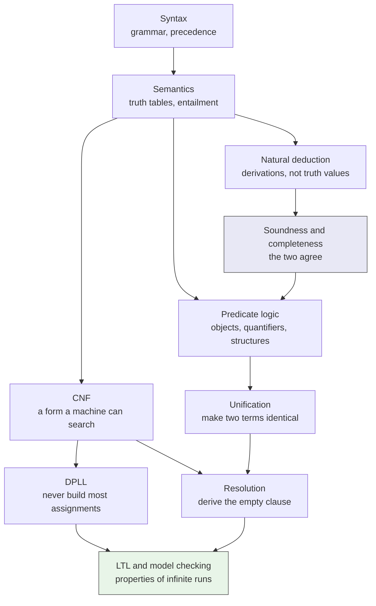

# learning-logic-in-computer-science

What I learned in a second-year logic module, how I studied it, and a small
library that makes the ideas runnable.

Two things are here, and the first is the point:

1. **A learning record** — my own notes on the arc from propositional syntax
   to model checking, and an account of the AI-assisted study system I built
   to get through the module in my second language.
   → [`docs/study-system.md`](docs/study-system.md), [`docs/notes/`](docs/notes/)
2. **`logickit`** — a dependency-free Python library and command line
   implementing the procedures the course taught, with 182 tests.

The module mark was **92/100**. It is here because a study method with no
result attached is only an opinion. It is a mark for the module; nothing in
this repository was assessed.

## Why implement any of it

Because I could carry out CNF conversion by hand well before I could write it,
and the gap between those two was where my understanding actually was.

Writing the code forced the questions I had been stepping over. What happens
to a clause containing both `p` and `¬p`? What *is* the empty clause? Why does
`X U ψ` hold immediately when `ψ` does, even if `X` never does? Each one was a
line of code that would not write itself until I knew the answer.

## The arc



Soundness and completeness are the hinge: they say `⊢` and `⊨` pick out the
same formulas, which is the licence to use whichever is cheaper. Everything
to the right of them is a way of being cheaper.

## The notes

| | |
|---|---|
| [1. Propositional logic](docs/notes/01-propositional-logic.md) | Syntax against semantics; valid, satisfiable, unsatisfiable; entailment and why one row refutes it |
| [2. Natural deduction](docs/notes/02-natural-deduction.md) | Introduction and elimination pairs; discharging assumptions; classical against intuitionistic |
| [3. Soundness and completeness](docs/notes/03-soundness-and-completeness.md) | What each theorem rules out; decidability is a separate question |
| [4. Predicate logic](docs/notes/04-predicate-logic.md) | Terms against formulas; capture; the freshness conditions; two-element counter-models |
| [5. CNF, DPLL and resolution](docs/notes/05-cnf-dpll-and-resolution.md) | Why CNF; what unit propagation buys; models against derivations |
| [6. Unification](docs/notes/06-unification.md) | The algorithm, the occurs check, and why "most general" matters |
| [7. Temporal logic and model checking](docs/notes/07-temporal-logic-and-model-checking.md) | Runs rather than states; `G F` against `F G`; counterexamples as the output |

All of it is written from scratch with my own examples. No course material is
reproduced here — see [What is not here](#what-is-not-here).

## The library, by example

```bash
pip install -e .
```

**An entailment that fails, and the row that kills it.** Affirming the
consequent, refuted mechanically:

```console
$ logickit entails "p" --premise "p -> q" --premise "q"
p -> q, q |/= p
counter-model: p=F, q=T
under that assignment every premise is true and the conclusion is false
```

**DPLL, showing that it never builds the truth table.** Three variables, no
branching at all:

```console
$ logickit solve "p & (~p | q) & (~q | r)" --trace
cnf: (p) & (~p | q) & (~q | r)

trace:
  unit propagate p
  unit propagate q
  unit propagate r
  all clauses satisfied

unit propagations: 3, pure literals: 0, decisions: 0, conflicts: 0
satisfiable: p=T, q=T, r=T
```

**Resolution, deriving the empty clause.** A proof of unsatisfiability you can
replay by hand:

```console
$ logickit refute "(p -> q) & p & ~q"
cnf: (~p | q) & (p) & (~q)

refuted in 3 resolution step(s):
  (p) + (~p | q) on p => (q)
  (~p | q) + (~q) on q => (~p)
  (~q) + (q) on q => ()

the empty clause was derived, so the formula is unsatisfiable
```

**Unification, with the occurs check earning its place:**

```console
$ logickit unify "p(f(X), Y, Z)" "p(f(a), g(Z), b)"
mgu  : {X := a, Y := g(b), Z := b}

$ logickit unify "X" "f(X)"
no unifier: X occurs in f(X), so no finite term unifies them
```

**Model checking, returning the run that breaks the property.** Against a
two-process mutual exclusion sketch, "process `a` runs infinitely often" is
false, and the counterexample is the starvation cycle:

```console
$ logickit check "G !(a & b)"
holds on every lasso within the bound

$ logickit check "G F a"
counterexample: (idle -> wait_b -> wait_both -> crit_b)^w
```

Other commands: `table` (truth table plus a validity verdict) and `cnf`
(negation normal form, then clauses).

Exit codes are meaningful: `0` the property holds, `1` it does not, `2` the
input could not be read.

## Modules

| Module | Contents |
|---|---|
| `formula` | Formula tree and a recursive descent parser; ASCII and Unicode notations |
| `semantics` | Evaluation, truth tables, validity, satisfiability, entailment, counter-models |
| `normal_forms` | Negation normal form, CNF as clauses, tautology and subsumption removal |
| `dpll` | Unit propagation, pure literals, branching, with a trace and statistics |
| `resolution` | The resolution rule and refutation by saturation |
| `unification` | First-order terms, most general unifier, occurs check |
| `temporal` | LTL, transition systems, lassos, bounded model checking |

## Setup and tests

Python 3.9 or newer. No runtime dependencies.

```bash
git clone https://github.com/sean-from-japan/learning-logic-in-computer-science.git
cd learning-logic-in-computer-science
python -m venv .venv && source .venv/bin/activate
pip install --upgrade pip
pip install -e . && pip install -r requirements-dev.txt
pytest        # 182 tests
ruff check .
```

The tests are mostly **cross-checks between two implementations of the same
question**, which is the only way I trusted any of this:

- CNF conversion is checked against the original formula on *every*
  assignment, for fourteen formulas — not on a couple of spot cases.
- DPLL's verdict is checked against the truth table, and its model is
  evaluated in the formula rather than assumed correct.
- Every resolution step is re-derived independently and confirmed to be a
  legal resolvent.
- Unification is checked by applying the substitution to both sides and
  asserting they are equal, and by asserting the result is most general.
- The parser's output is printed and re-parsed, so precedence and bracketing
  cannot silently disagree.

Three of those cross-checks failed the first time I ran them. Two were wrong
expectations of mine about `U` and about what CNF does to a contradiction —
both now stand as tests with the correction written into them.

## Limitations

- **Truth-table methods are exponential**, deliberately. `semantics` builds
  every assignment. That is the baseline DPLL is measured against, not a
  recommendation.
- **CNF conversion is the exponential one.** Distribution can multiply the
  clause count. A structure-preserving translation would be linear and
  equisatisfiable; it is not implemented, because the point here was to see
  the blow-up rather than avoid it.
- **Resolution is naive saturation** with a step limit. No ordering, no set of
  support, no indexing.
- **Unification is propositional-free syntax only.** There is no predicate
  resolution built on top of it, which is the obvious next piece.
- **The model checker is explicit-state and bounded.** It enumerates lassos up
  to a path length and evaluates the formula on each. It finds counterexamples
  soundly; a "holds" verdict is relative to the bound. A real checker builds a
  Büchi automaton from the negated formula and searches the product for an
  accepting cycle.
- **LTL atom names cannot be `X`, `G`, `F` or `U`.** The parser reserves them.
- **No natural deduction proof checker.** Semantic claims here are checked
  mechanically; syntactic ones I still check by hand. Closing that gap is the
  next thing worth building.

## What is not here

No lecture slides, no exercise sheets, no exam questions, no model answers, no
past papers, and no explanation copied or paraphrased from course material.
Every note, example, formula, transition system and line of code in this
repository was written for this repository.

The source is a second-year Logic in Computer Science module, taken on exchange
in spring 2026. The university and the module code are left out on purpose; ask
me directly if you need them to verify this. None of its material is reproduced.

## Licence

MIT — see [LICENSE](LICENSE). All code and writing here are my own work.
