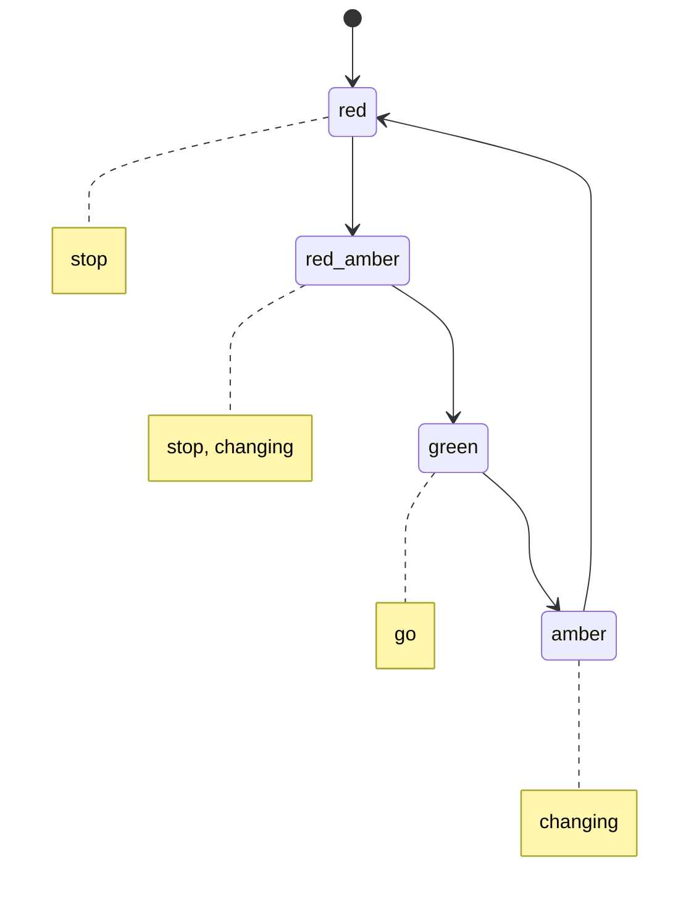

# 7. Temporal logic and model checking

## The question this answers

Everything so far treats a formula as a claim about one situation. A running
system is not one situation: it is an infinite sequence of them, and the
properties that matter are about that sequence.

- The two processes are never in the critical section at the same time.
- A process that asks for the resource eventually gets it.
- The light never goes from red straight to green.

None of those is a statement about a state. Each is a statement about a
**run**.

## Transition systems

Model the system as states, transitions between them, and a set of atomic
propositions true in each state.



A **run** is an infinite path from the initial state. Deadlock states are
excluded here rather than given an implicit self-loop, because "infinite run"
otherwise stops meaning anything — and a deadlock is normally the bug, not a
detail to paper over.

## The operators

Linear temporal logic adds four:

| | Reading | True when |
|---|---|---|
| `X φ` | next | φ holds at the next position |
| `G φ` | globally | φ holds at every position from here |
| `F φ` | finally | φ holds at some position from here |
| `φ U ψ` | until | ψ holds eventually, and φ holds at every position before it |

Two combinations carry most of the practical weight:

- **`G F φ`** — infinitely often. Not "eventually" once, but again and again
  forever. This is how fairness is written.
- **`F G φ`** — eventually always. From some point on, φ never fails again.
  This is how stabilisation is written.

They are different and swapping them is a real bug. `G F` is "the light turns
green again and again"; `F G` is "the light eventually turns green and stays
green".

## Until has an edge case

`φ U ψ` is satisfied **immediately** if `ψ` already holds, no matter what `φ`
does — including if `φ` is false. The obligation on `φ` covers only the
positions strictly before `ψ` first holds, and if that is position zero, there
are none.

```python
# stop holds at red, so "go U stop" is true at red even though go never does
holds(traffic, run, Until(Atom("go"), Atom("stop")))   # True
```

This is the operator that catches people out, and it has its own test here for
that reason.

## Model checking

Given a system and a formula, decide whether **every** run satisfies it, and if
not, produce a run that does not.

The counterexample is the entire practical value. "Your mutual exclusion
property does not hold" is not actionable; a specific interleaving is.

```bash
logickit check "G F a"
# counterexample: (idle -> wait_b -> wait_both -> crit_b)^w
```

That is starvation, shown rather than described: a cycle in which process `b`
runs forever and `a` never does. The specification "process `a` runs
infinitely often" is false in this system, and the trace says exactly why.

## Why lassos

A system with finitely many states has infinitely many runs, but every run
that matters has a repeating shape: a finite prefix and then a cycle,
traversed forever. That is a **lasso**, and it is finite to write down and
finite to check, because every temporal operator only has to look one lap
around the cycle.

That is what makes checking possible at all: not that infinite behaviour was
avoided, but that infinitely many infinite runs collapse into finitely many
finite descriptions.

## What this implementation is not

The checker here enumerates reachable lassos up to a path bound and evaluates
the formula on each. A real model checker translates the *negated* formula
into a Büchi automaton, takes its product with the system, and searches for a
reachable accepting cycle — which avoids enumerating runs at all, and is what
makes state spaces of billions tractable.

Enumeration was the right choice for learning: the semantics of every
operator is visible in the code, and the automaton construction would have
hidden them behind a translation I would have been copying rather than
understanding. It is the wrong choice for anything real, and the README says
so.

## Why this was the last topic

Because it is where the course arrives somewhere. The same skill — say
precisely what must be true, then search for a case where it is not — that
started with a two-row counter-model for a propositional formula ends as the
technique used to verify cache-coherence protocols and operating system
kernels. The counter-model got bigger. Nothing else changed.
